# 

<!-- Animated Wave Header with Enhanced Typography -->
<div align="center">
  
</div>

<!-- Animated Title with Rainbow Effect and Custom Font -->
<div align="center">
  <a href="https://git.io/typing-svg">
    
  </a>
</div>

<!-- Animated Social Links -->
<div align="center">
  
  <a href="https://www.linkedin.com/in/alihaideryahya/">
    
  </a>
  <a href="https://github.com/ialihaideryahya">
    
  </a>
  <a href="mailto:haideryahya806@gmail.com">
    
  </a>
  
  
  <br><br>
  
  
  
  
</div>

<!-- Animated Divider -->


##  About Me 

<!-- Enhanced Animated About Me Section -->
<div align="center">
  
  <!-- Animated Role Title -->

  
  <!-- Animated Stats Cards -->
  <table>
    <tr>
      <td width="33%" align="center">
        
      </td>
      <td width="67%">
        
  <!-- Beautiful Profile Card with Glassmorphism Effect -->
  <div style="background: linear-gradient(135deg, #667eea 0%, #764ba2 100%); padding: 2px; border-radius: 20px;">
    
  ```yaml
  👨‍💻 Ali Haider
  ━━━━━━━━━━━━━━━━━━━━━━━━━━━━━━━━━━━━━━━━━━━
  
  🎯 Current Role: Mid-Level Software Developer @ Devscomet
  📍 Location: Islamabad, Pakistan 🇵🇰
  🎓 Education: BS Software Engineering (CGPA: 3.73/4.0)
  ⚡ Experience: 5+ Years of Crafting Digital Excellence
  
  🔥 CORE EXPERTISE:
  ┣━━ Frontend Magic ━━━━━━━━━━━━━━━━━━━━━━━━
  ┃   ► React.js | Angular | Next.js
  ┃   ► TypeScript | JavaScript ES6+
  ┃   ► Tailwind CSS | Material-UI
  ┃
  ┣━━ Backend Wizardry ━━━━━━━━━━━━━━━━━━━━━
  ┃   ► .NET Core | Node.js | Express.js
  ┃   ► RESTful APIs | GraphQL
  ┃   ► Microservices Architecture
  ┃
  ┣━━ Cloud & DevOps ━━━━━━━━━━━━━━━━━━━━━━━
  ┃   ► Azure | AWS | Docker
  ┃   ► Kubernetes | CI/CD Pipelines
  ┃   ► Infrastructure as Code
  ┃
  ┗━━ Database Mastery ━━━━━━━━━━━━━━━━━━━━━
      ► PostgreSQL | MongoDB
      ► SQL Server | Firebase
      ► Redis | Elasticsearch
  
  💫 ACHIEVEMENTS UNLOCKED:
  ╔════════════════════════════════════════════╗
  ║ 🚀 50+ Projects Successfully Delivered     ║
  ║ ⚡ 40% Faster Deployment Times Achieved    ║
  ║ 👥 Mentored 3 Junior Developers            ║
  ║ 🏆 Top Performer Award at HUAWEI           ║
  ╚════════════════════════════════════════════╝
  
  🌈 CURRENT MISSION:
  "Building the future, one commit at a time,
   transforming ideas into scalable solutions!"
  ```
  
  </div>
      </td>
    </tr>
  </table>
  
  <!-- Animated Info Bubbles -->
  <div align="center">
    
  </div>
  
  <!-- Interactive Stats Display with Animation -->
  <table align="center">
    <tr>
      <td align="center">
        
        <br>
        
      </td>
      <td align="center">
        
        <br>
        
      </td>
      <td align="center">
        
        <br>
        
      </td>
      <td align="center">
        
        <br>
        
      </td>
    </tr>
  </table>
  
  <!-- Animated Personality Traits -->
  <div align="center">
    <h3> My Developer DNA </h3>

  </div>
  
</div>

<!-- Animated Skills Section -->
##  Tech Stack Mastery

<div align="center">

###  Frontend Magic


###  Backend Wizardry  


###  Database & Cloud Sorcery


###  Tools & DevOps Arsenal


</div>

<!-- Animated Divider -->


## 🏆 Trophy Cabinet & Achievements

<div align="center">
  
[](https://github.com/ryo-ma/github-profile-trophy)

### 🎯 Impact Metrics

<table>
  <tr>
    <td align="center">
      
      <br><b style="font-family: 'Segoe UI', Tahoma, Geneva, Verdana, sans-serif;">Freelance Excellence</b>
    </td>
    <td align="center">
      
      <br><b style="font-family: 'Segoe UI', Tahoma, Geneva, Verdana, sans-serif;">DevOps Mastery</b>
    </td>
    <td align="center">
      
      <br><b style="font-family: 'Segoe UI', Tahoma, Geneva, Verdana, sans-serif;">Leadership Impact</b>
    </td>
    <td align="center">
      
      <br><b style="font-family: 'Segoe UI', Tahoma, Geneva, Verdana, sans-serif;">Academic Excellence</b>
    </td>
  </tr>
</table>

</div>

##  Featured Projects Showcase

<div align="center">

<!-- Project Cards with Hover Effects -->
<table>
  <tr>
    <td align="center" width="50%">
      <h3 style="font-family: 'Bebas Neue', cursive; font-size: 1.5em;">☁️ Cloud Management Portal</h3>
      
      
      
      <br><br>
      <i style="font-family: 'Ubuntu', sans-serif;">ETL Pipeline Management with Power BI Integration</i>
      <br>
      <b style="font-family: 'Righteous', cursive;">🔥 2024 | Enterprise Solution</b>
    </td>
    <td align="center" width="50%">
      <h3 style="font-family: 'Bebas Neue', cursive; font-size: 1.5em;">🌐 Unifaires Platform</h3>
      
      
      
      <br><br>
      <i style="font-family: 'Ubuntu', sans-serif;">Multi-language Platform with Real-time Features</i>
      <br>
      <b style="font-family: 'Righteous', cursive;">🚀 2025 | Full Stack</b>
    </td>
  </tr>
  <tr>
    <td align="center" width="50%">
      <h3 style="font-family: 'Bebas Neue', cursive; font-size: 1.5em;">🎓 Cerifi Edutech</h3>
      
      
      
      <br><br>
      <i style="font-family: 'Ubuntu', sans-serif;">Multi-tenant LMS for Financial Education</i>
      <br>
      <b style="font-family: 'Righteous', cursive;">📚 2023 | EdTech Solution</b>
    </td>
    <td align="center" width="50%">
      <h3 style="font-family: 'Bebas Neue', cursive; font-size: 1.5em;">🤖 HelloDrew AI</h3>
      
      
      
      <br><br>
      <i style="font-family: 'Ubuntu', sans-serif;">AI-Powered Real Estate Assistant</i>
      <br>
      <b style="font-family: 'Righteous', cursive;">🏠 Freelance | AI Innovation</b>
    </td>
  </tr>
</table>

</div>

<!-- Animated Statistics -->
## 📊 GitHub Analytics Dashboard

<div align="center">
  
</div>

<div align="center">
  
  
</div>

<div align="center">
  
</div>

<!-- Contribution Graph with Animation -->
<div align="center">
  <h2 style="font-family: 'Bebas Neue', cursive; font-size: 2em;">🔥 Contribution Heatmap</h2>
  
</div>

<!-- Snake animation -->
<div align="center">
  <h2 style="font-family: 'Bebas Neue', cursive; font-size: 2em;">🐍 Watch My Contributions Snake</h2>
  <picture>
    <source media="(prefers-color-scheme: dark)" srcset="https://raw.githubusercontent.com/platane/snk/output/github-contribution-grid-snake-dark.svg">
    <source media="(prefers-color-scheme: light)" srcset="https://raw.githubusercontent.com/platane/snk/output/github-contribution-grid-snake.svg">
    
  </picture>
</div>

## 🎯 Current Focus & Learning Journey

<div align="center">
  <table>
    <tr>
      <td align="center" width="33%">
        
        <br><b style="font-family: 'Righteous', cursive;">🔭 Currently Working On</b><br>
        <span style="font-family: 'Ubuntu', sans-serif;">Cloud Infrastructure<br>
        Microservices Architecture<br>
        AI Integration</span>
      </td>
      <td align="center" width="33%">
        
        <br><b style="font-family: 'Righteous', cursive;">🌱 Learning</b><br>
        <span style="font-family: 'Ubuntu', sans-serif;">Kubernetes Orchestration<br>
        System Design<br>
        Web3 Technologies</span>
      </td>
      <td align="center" width="33%">
        
        <br><b style="font-family: 'Righteous', cursive;">💡 Interests</b><br>
        <span style="font-family: 'Ubuntu', sans-serif;">Open Source<br>
        Tech Mentorship<br>
        Innovation</span>
      </td>
    </tr>
  </table>
</div>

<!-- Professional Timeline -->
## 🚀 Professional Journey Timeline

```mermaid
graph LR
    A[2020: Started BS Software Engineering] -->|Freelancing| B[2022: HUAWEI Internship]
    B --> C[2022-2023: Devscomet Intern]
    C --> D[2023: Junior Developer]
    D --> E[2023-2024: Associate Engineer]
    E --> F[2024-Present: Mid-Level Developer]
    F --> G[Future: Senior Architect]
    
    style A fill:#ff6b6b
    style B fill:#4ecdc4
    style C fill:#45b7d1
    style D fill:#96ceb4
    style E fill:#ffeaa7
    style F fill:#dfe6e9
    style G fill:#74b9ff
```

<div align="center">



</div>

## 💬 Random Dev Quote

<div align="center">
  
</div>

## 🤝 Let's Connect & Collaborate!

<div align="center">
  
  
  
  
  <br><br>
  
  <h3 style="font-family: 'Bebas Neue', cursive; font-size: 1.8em;">💌 Reach Out to Me!</h3>
  
  <div style="font-family: 'Ubuntu', sans-serif; font-size: 1.1em;">
    
  📧 **Email:** haideryahya806@gmail.com
  📱 **Phone:** +92 300 7532806 
  📍 **Location:** Islamabad, Pakistan  
  💼 **Open for:** Freelance Projects | Full-time Opportunities | Collaborations
  
  </div>
  
  <br>
  
  <a href="https://www.linkedin.com/in/alihaideryahya/">
    
  </a>
</div>

<!-- Animated Footer -->


<div align="center">
  
  ###  Thanks for visiting! 
  
  
  
  ⭐️ **From [ghufran496](https://github.com/ialihaideryahya) with** 
  
</div>
